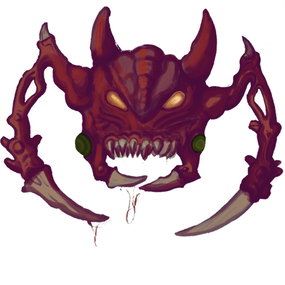

#Space Invaders Remake (SIR)
===========

--------

Current development status
======
We are working on version 0.7.

The gif bellow shows how it looks like right know:

Download
======
See our [releases page](https://github.com/skahal/SpaceInvadersRemake/releases).

Roadmap
======
- Version 0.7
	- Our sprites and animations
- Version 0.8
	- Our sound
- Version 1.0
	- ?

FAQ
======

Having troubles? 
 - Ask on Twitter [@ogiacomelli](http://twitter.com/ogiacomelli), [@giusepe](http://twitter.com/giusepe) and [@skahal](http://twitter.com/skahal).
 
 --------

How to improve it?
======

- Create a fork of [SpaceInvadersRemake](https://github.com/skahal/SpaceInvadersRemake/fork). 

- Download and install [Spine Unity Runtimes packages](https://github.com/EsotericSoftware/spine-runtimes/tree/master/spine-unity). 

- Did you change it? [Submit a pull request](https://github.com/skahal/SpaceInvadersRemake/pull/new/master).

License
======
Licensed under the The MIT License (MIT).
In others words, you can use this game for developement any kind of software: open source, commercial, proprietary and alien.

Change Log
======
 - v0.6-original-remake
 	 - Original Atari 2600's sound effects
 - v0.5-original-remake
 	- No menus or any extra screens
	- Running with original Atari 2600 sprites
	- No sound
	- No juiceness